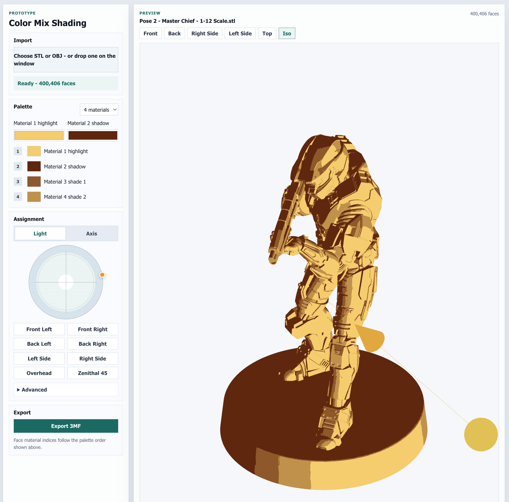

# Color Mix Shading

Client-side STL/OBJ color-material preview and 3MF export tool.

**Live demo:** [gzeus.github.io/Color-Mix-Shading](https://gzeus.github.io/Color-Mix-Shading/)

[](https://gzeus.github.io/Color-Mix-Shading/)

## Static Deployment

This app is a Vite React single-page app. Build it with:

```bash
npm run build
```

The production output is written to `dist/`. The Vite config uses `base: './'` so generated asset URLs are relative and work on static hosts, including deployments served from a subpath.

### Vercel

- Framework preset: `Vite`
- Build command: `npm run build`
- Output directory: `dist`

### Netlify

- Build command: `npm run build`
- Publish directory: `dist`

### Cloudflare Pages

- Framework preset: `Vite`
- Build command: `npm run build`
- Build output directory: `dist`

### GitHub Pages

A workflow at `.github/workflows/deploy-pages.yml` builds and deploys to GitHub Pages on every push to `main` (and can also be run manually via the Actions tab).

One-time setup (requires repo admin):

1. Open the repo on GitHub → **Settings** → **Pages**.
2. Under **Build and deployment** → **Source**, choose **GitHub Actions**.
3. Push to `main` (or run the *Deploy to GitHub Pages* workflow manually from the Actions tab) to trigger the first deploy.
4. Once the workflow completes, the site URL appears at the top of the Pages settings page and on the `github-pages` environment.

The Vite `base: './'` setting means the build works whether Pages serves the site from the root domain or a `/<repo>/` subpath, so no extra config is needed.

## Production Runtime

The deployed app does not need a Node.js runtime. Node is only required during install/build. Mesh parsing, preview rendering, material assignment, and 3MF packaging all run in the browser.

## License

Released under the [MIT License](./LICENSE).
